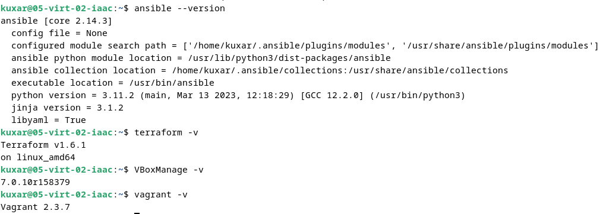
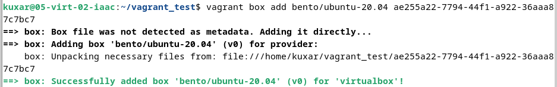

# 05-virt-02-iaac
Домашнее задание к занятию 2. «Применение принципов IaaC в работе с виртуальными машинами»

Задача 1

    1. Основные плюсы IaaC-паттернов заключаются в скорости равертики ВМ, а также в их однотипности.
    2. Одним из основополагающих принципов IaaC является то что при повторном выполнении задачи мы
    получаем результат идентичный предыдущему.
    
Задача 2

    1. Основное преимущество перед другими системами управления конфигурациями заключается в том что
    нет необходимости устанавливать на целевые хосты агента и имеет небольшой порог для входа.
    2. Я считаю что метод работы систем конфигурации "Push" более надежная так как централизованно
    управляет конфигурацией и исключает ситуации, когда на сервере были внесены правки вручную,
    которые небыли отражены в системах управление конфигурацией.
    
Задача 3

Задача 4

